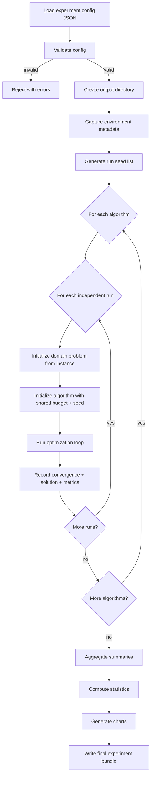

# Metaheuristic Optimization Platform — Pipeline Definition

This document defines the **end-to-end pipelines** for the project before implementation begins. It complements `metaheuristic_optimization_project_overview.md` by specifying:

- What happens when an experiment runs (runtime pipeline)
- How modules connect (architecture pipeline)
- In what order we build (development pipeline)
- What must be decided before each stage (decision gates)

**Status:** Pre-build planning document  
**Last updated:** 2026-08-03

---

## 1. Pipeline Goals

The pipeline must enforce four properties from the research specification:

| Property | Pipeline requirement |
|----------|---------------------|
| Fairness | Same instance, objective, evaluation budget, and seed policy for all algorithms in a comparison |
| Reproducibility | Every stage emits machine-readable artifacts; experiments can be rerun from saved config |
| Modularity | Domains and algorithms plug into shared interfaces; no cross-domain logic inside algorithm cores |
| Traceability | Every objective evaluation, seed, parameter, and stop reason is recorded |

---

## 2. System Layers (Top-Down)

```text
┌─────────────────────────────────────────────────────────────┐
│  Layer 4: Presentation                                      │
│  CLI → (later) Dashboard / Web UI                           │
└──────────────────────────────┬──────────────────────────────┘
                               │
┌──────────────────────────────▼──────────────────────────────┐
│  Layer 3: Analysis & Export                                 │
│  Statistics → Visualization → CSV / JSON / Charts           │
└──────────────────────────────┬──────────────────────────────┘
                               │
┌──────────────────────────────▼──────────────────────────────┐
│  Layer 2: Experiment Orchestration                          │
│  Config → Validation → Batch Runner → Aggregation           │
└──────────────────────────────┬──────────────────────────────┘
                               │
┌──────────────────────────────▼──────────────────────────────┐
│  Layer 1: Optimization Engine                               │
│  Algorithm (SA / TS / PSO) × Problem Domain (TSP / Sched / FS) │
└──────────────────────────────┬──────────────────────────────┘
                               │
┌──────────────────────────────▼──────────────────────────────┐
│  Layer 0: Core Infrastructure                               │
│  Budget counter, seeds, logging, result models, storage     │
└─────────────────────────────────────────────────────────────┘
```

**Build order:** Layer 0 → Layer 1 (one domain at a time) → Layer 2 → Layer 3 → Layer 4.

Layer 4 (full UI) is optional for the first working milestone; a **CLI + file outputs** path is the minimum viable presentation layer.

---

## 3. Runtime Pipeline (Single Experiment)

This is the path from user intent to stored results.



### 3.1 Stage Definitions

| Stage | Input | Output | Owner module |
|-------|-------|--------|--------------|
| **S1 — Load config** | `experiment_config.json` | Parsed `ExperimentConfig` | `config/` |
| **S2 — Validate** | Config + schema rules | Pass/fail + error list | `config/`, `domains/` |
| **S3 — Prepare run context** | Valid config | Output dir, `environment.json`, `seeds.csv` | `experiments/` |
| **S4 — Instantiate problem** | Domain + instance path | `OptimizationProblem` | `domains/` |
| **S5 — Instantiate algorithm** | Algorithm params + problem + seed | `OptimizationAlgorithm` | `algorithms/` |
| **S6 — Execute run** | Algorithm + evaluation budget | `RunResult` + convergence CSV + solution JSON | `experiments/`, `algorithms/` |
| **S7 — Aggregate** | All run results | `runs.csv`, `summary.csv` | `experiments/`, `metrics/` |
| **S8 — Analyze** | Aggregated data | `statistics.csv` (optional inferential) | `statistics/` |
| **S9 — Visualize** | Aggregated + convergence data | Charts in `charts/` | `visualization/` |
| **S10 — Finalize** | All artifacts | Self-contained experiment folder | `storage/` |

### 3.2 Optimization Loop (Inside S6)

Every algorithm follows the same inner contract:

```text
1. initialize(problem, config, seed)
2. WHILE budget.remaining() AND NOT stop_condition:
       step()                    # may call problem.evaluate()
       history.record(snapshot)
3. RETURN RunResult(best_solution, best_objective, history, stop_reason)
```

**Budget rule:** `problem.evaluate()` increments the shared evaluation counter. Algorithms must not bypass this for fair comparison.

**Stop reasons (enum):**

- `evaluation_budget_exhausted`
- `runtime_limit_reached`
- `no_improvement_threshold`
- `algorithm_max_iterations`
- `cancelled`
- `error`

### 3.3 Per-Run Artifact Contract

Each run writes:

```text
results/<experiment_id>/
├── experiment_config.json      # full config (immutable copy)
├── environment.json            # OS, Python, deps, hardware
├── seeds.csv                   # run_id, algorithm, seed
├── runs.csv                    # one row per run (all algorithms)
├── summary.csv                 # grouped by algorithm
├── statistics.csv              # optional inferential summaries
├── convergence/
│   └── {algo}_run_{nnn}.csv    # eval_count, best_objective, ...
├── solutions/
│   └── {algo}_run_{nnn}.json   # domain-specific best solution
├── charts/
│   └── *.png
└── logs/
    └── experiment.log
```

---

## 4. Domain Pipelines

Each problem domain has a sub-pipeline that plugs into S4–S6.

### 4.1 TSP Pipeline

```text
Instance file → Loader → Distance matrix / coordinates
                       → Initial route (random or heuristic)
                       → Neighborhood operators (swap, insert, invert, 2-opt)
                       → evaluate(route) → total distance incl. return edge
                       → validate(permutation complete, no duplicates)
                       → serialize(route, distance, gap)
```

**Decision gate (before TSP build):**

- [ ] Benchmark source and file format
- [ ] Operator set (is 2-opt a standard move or hybrid local search?)
- [ ] Instance size tiers for scalability study

### 4.2 Scheduling Pipeline

```text
Instance file → Loader → [DECISION: formulation TBD]
                       → Decoder(representation → schedule)
                       → evaluate(schedule) → makespan
                       → validate(precedence, no overlap, machine eligibility)
                       → serialize(schedule, Gantt data)
```

**Decision gate (before Scheduling build):**

- [ ] Exact formulation (job-shop, flow-shop, parallel-machine, etc.)
- [ ] Solution representation + decoder design
- [ ] Benchmark dataset
- [ ] Neighborhood / PSO movement rules for that formulation

**Placeholder strategy:** Implement `SchedulingProblem` interface with a `NotConfiguredError` until formulation is chosen. Do not invent constraints.

### 4.3 Feature Selection Pipeline

```text
Dataset file → Loader → Train/val/test split (fixed policy)
                      → Fit preprocessing on TRAIN only
                      → Binary vector → select features
                      → Train classifier on selected features (train/val only)
                      → evaluate → weighted objective(performance, reduction)
                      → validate(min 1 feature unless allowed)
                      → Final test eval (post-optimization, never in loop)
                      → serialize(selected indices, metrics)
```

**Decision gate (before Feature Selection build):**

- [ ] Dataset(s)
- [ ] Classifier
- [ ] Predictive metric
- [ ] Objective weights (`performance_weight`, `reduction_weight`)
- [ ] Split / CV procedure

**Hard rule:** Test set is never passed into `evaluate()` during optimization.

---

## 5. Algorithm Pipelines

All three algorithms share the same outer lifecycle; only `step()` differs.

| Algorithm | One step (conceptual) | Evaluations per step (typical) |
|-----------|----------------------|--------------------------------|
| **SA** | Generate neighbor → accept/reject → maybe cool | 1 per step |
| **TS** | Generate candidate list → pick best admissible → update tabu | 1 × candidate_list_size per step |
| **PSO** | Update swarm → decode positions → evaluate particles | swarm_size per generation |

This is why **iteration count is not the primary budget** — only objective evaluations are comparable.

### 5.1 Algorithm ↔ Domain Binding

Algorithms do not know domain details. They call problem methods:

```python
# Conceptual — not final code
problem.create_initial_solution(rng)
problem.evaluate(solution)       # increments budget
problem.neighbors(solution, op)  # or domain-specific neighbor API
problem.is_valid(solution)
problem.repair(solution)         # only if approved
```

Domain-specific move operators are registered via config, not hard-coded in algorithm files.

---

## 6. Development Pipeline (Build Phases)

Phases from the overview, refined with **entry criteria**, **deliverables**, and **exit gates**.

### Phase 0 — Project Scaffold *(new, before Phase 1)*

**Purpose:** Repo structure, tooling, and empty interfaces.

| Item | Deliverable |
|------|-------------|
| Repo layout | `src/` tree per overview §13 |
| Tooling | `pyproject.toml`, lint, test runner |
| CI stub | Run tests on push (optional but recommended) |
| Decision registry | `config/decisions.yaml` — all unresolved choices |
| Example configs | Placeholder JSON with `TODO` markers |

**Exit gate:** Project installs, tests run (even if zero tests), folder structure matches spec.

---

### Phase 1 — Core Framework

**Entry:** Phase 0 complete.

**Build:**

- `OptimizationAlgorithm` base + registry
- `OptimizationProblem` base + registry
- `EvaluationBudget` (single source of truth for eval count)
- `SeedManager` (base seed → deterministic run seeds)
- `RunResult`, `ExperimentConfig` data models
- Config loader + JSON schema validation
- Structured logging

**Exit gate:**

- [ ] Mock problem + mock algorithm completes a run
- [ ] Budget stops at exact evaluation limit
- [ ] Same seed → same result on mock
- [ ] Run artifacts written to correct paths

---

### Phase 2 — TSP Domain + Three Algorithms on TSP

**Entry:** Phase 1 exit gate passed **and** TSP decision gate (§4.1) resolved.

**Build order within phase:**

```text
TSP loader → evaluator → validator → neighborhoods
    → SA/TSP → TS/TSP → PSO/TSP
    → TSP metrics → route chart
    → unit + integration tests
```

**Exit gate:**

- [ ] SA, TS, PSO each complete on at least one benchmark instance
- [ ] Gap from known optimum computed when optimum available
- [ ] 30-run batch executes without manual intervention
- [ ] Convergence CSV + route JSON exported

**Milestone:** First end-to-end comparison (TSP only) via CLI.

---

### Phase 3 — Scheduling

**Entry:** Phase 2 complete **and** scheduling decision gate (§4.2) resolved.

**Exit gate:**

- [ ] Valid schedules only; makespan correct on small known instance
- [ ] Gantt chart generated
- [ ] All three algorithms run on scheduling domain

---

### Phase 4 — Feature Selection

**Entry:** Phase 3 complete **and** feature-selection decision gate (§4.3) resolved.

**Exit gate:**

- [ ] Leakage test proves test set not used in optimization
- [ ] Preprocessing fit on train only
- [ ] All three algorithms run on feature selection

---

### Phase 5 — Experiment Runner (Full Batch)

**Entry:** At least one domain complete (typically after Phase 2 for early value).

**Build:**

- Multi-algorithm batch runner
- Shared seed list across algorithms
- Progress callbacks + cancellation
- Failure isolation (one bad run does not kill batch)
- Result aggregation

**Exit gate:**

- [ ] Compare SA/TS/PSO in one command on same config
- [ ] Failed run logged; other runs continue

---

### Phase 6 — Analysis & Visualization

**Entry:** Phase 5 complete.

**Build:**

- Descriptive stats (mean, std, median, IQR, min, max)
- Convergence plots (primary x-axis: objective evaluations)
- Box plots, runtime comparison, scalability plots
- Domain-specific charts (route, Gantt, feature frequency)

**Exit gate:**

- [ ] Summary + charts generated automatically after batch
- [ ] CSV exports suitable for external statistical tools

---

### Phase 7 — User Interface

**Entry:** Phase 6 complete **and** UI technology decision resolved.

**Minimum viable UI:** CLI with subcommands:

```text
optimize run --config experiment_config.json
optimize validate --config experiment_config.json
optimize reproduce --experiment-dir results/...
optimize list
```

**Full UI (optional):** Dashboard for New Experiment / Running / Results / History screens per overview §16.

---

### Phase 8 — Validation & Documentation

**Entry:** All targeted domains implemented.

**Build:**

- Unit, integration, reproducibility, known-case tests
- Example experiment configs per domain
- README with pipeline diagram and reproduction steps

**Exit gate:** All items in overview §26 (Definition of Done).

---

## 7. Decision Registry

Unresolved research choices live in one place. **Implementation must read from here, not assume defaults.**

| ID | Area | Decision needed | Blocks | Placeholder until decided |
|----|------|-----------------|--------|---------------------------|
| D1 | Tech | Programming language | Phase 0 | **Recommend: Python 3.11+** (pending approval) |
| D2 | Tech | UI framework | Phase 7 | CLI first |
| D3 | Tech | Storage | Phase 0 | File-only (JSON + CSV) |
| D4 | TSP | Benchmark datasets + format | Phase 2 | — |
| D5 | TSP | Move operators + 2-opt policy | Phase 2 | — |
| D6 | Sched | Formulation + representation | Phase 3 | Stub interface only |
| D7 | Sched | Benchmark instance | Phase 3 | — |
| D8 | FS | Dataset(s) | Phase 4 | — |
| D9 | FS | Classifier + metric + weights | Phase 4 | — |
| D10 | Exp | Number of runs, budgets, size tiers | Phase 2+ | Configurable, no hardcoded research values |
| D11 | Exp | Statistical tests + α + correction | Phase 6 | Export-only until approved |
| D12 | Exp | Parameter tuning protocol | Phase 2+ | Document as separate tuning pipeline |

**Action before Phase 2:** Resolve D1, D4, D5 at minimum.

---

## 8. Parameter Tuning Pipeline (Separate from Comparison)

Tuning must not contaminate fair comparison. Use a **separate sub-pipeline**:

```text
Tuning instances (held out from final test)
    → Grid / manual search per algorithm
    → Record tuning budget and method
    → Select parameters by validation rule (e.g. best mean over N runs)
    → Freeze chosen parameters
    → Final comparison on separate test instances only
```

This pipeline is **not automated hyperparameter optimization** unless explicitly approved (overview §22.2).

---

## 9. Scalability Study Pipeline

Run after single-instance comparison works:

```text
For each problem_size tier in config:
    For each instance at that tier:
        For each algorithm (frozen params):
            Run N independent trials with shared seeds
    Aggregate by (domain, size, algorithm)
    Plot: objective vs size, runtime vs size, eval count vs size
```

Size tiers are config-driven, not hard-coded.

---

## 10. Interface Contracts (Pre-Code)

These contracts should be implemented in Phase 1 before any domain work.

### 10.1 `OptimizationProblem`

| Method | Responsibility |
|--------|----------------|
| `create_initial_solution(rng)` | Valid starting solution |
| `evaluate(solution)` | Objective value; increments budget |
| `is_valid(solution)` | Constraint check |
| `repair(solution)` | Optional; only if documented |
| `get_neighbors(solution, operator, rng)` | For SA/TS |
| `decode_for_pso(position)` | For PSO discrete encoding |
| `serialize_solution(solution)` | JSON-serializable dict |
| `domain_metrics(solution)` | Gap, makespan detail, feature list, etc. |

### 10.2 `OptimizationAlgorithm`

| Method | Responsibility |
|--------|----------------|
| `initialize(problem, config, seed)` | Reset state |
| `step()` | One iteration; returns whether to continue |
| `run()` | Loop until budget or stop |
| `get_best_solution()` | Best found |
| `get_best_objective()` | Best objective value |
| `get_history()` | Convergence records |
| `get_stop_reason()` | Why loop ended |

### 10.3 `ExperimentRunner`

| Method | Responsibility |
|--------|----------------|
| `validate(config)` | Pre-flight checks |
| `run(config)` | Full batch; returns experiment dir path |
| `run_single(algorithm, problem, run_config)` | One independent run |

---

## 11. Recommended Technology Defaults (Pending Approval)

These are **recommendations for pipeline planning**, not final research decisions.

| Component | Recommendation | Rationale |
|-----------|----------------|-----------|
| Language | Python 3.11+ | Fast prototyping, strong ML/scientific stack |
| Config | JSON + JSON Schema | Human-readable, matches spec examples |
| CLI | `typer` or `click` | Good UX without UI framework commitment |
| Tests | `pytest` | Standard, fits reproducibility tests |
| Charts | `matplotlib` | Sufficient for research exports |
| ML (feature selection) | `scikit-learn` | Classifiers, preprocessing, metrics |
| Storage | File system only | Matches spec; no DB dependency |
| Packaging | `pyproject.toml` + optional `uv`/`pip` | Reproducible environments |

Approve or override in decision **D1** before Phase 0 scaffold.

---

## 12. First Build Target (Suggested)

To get value quickly without waiting for all decisions:

**Target:** *TSP-only vertical slice*

```text
Phase 0 → Phase 1 → Phase 2 (TSP) → Phase 5 (minimal runner) → CLI
```

Deliverable: One command compares SA vs TS vs PSO on one TSP instance with exported CSV, convergence plots, and reproducible config.

Scheduling and feature selection plug in later using the same runtime pipeline (§3).

---

## 13. Pre-Build Checklist

Before writing domain logic, confirm:

- [ ] This pipeline document reviewed and approved
- [ ] Decision D1 (language/tooling) approved
- [ ] Decision D4, D5 (TSP data + operators) approved for first slice
- [ ] Output folder layout (§3.3) approved
- [ ] Interface contracts (§10) approved
- [ ] First build target (§12) agreed

---

## 14. Document Map

| Document | Role |
|----------|------|
| `metaheuristic_optimization_project_overview.md` | Full requirements and research context |
| `pipeline_definition.md` (this file) | Runtime flow, build order, gates, contracts |
| `config/decisions.yaml` *(Phase 0)* | Living registry of resolved/unresolved decisions |
| `config/examples/*.json` *(Phase 0)* | Runnable experiment templates |

---

## 15. Next Step

1. **Review this pipeline** — confirm build order, CLI-first approach, and TSP vertical slice as first target.
2. **Resolve decision gates** — at minimum D1, D4, D5 for Phase 0–2.
3. **Scaffold Phase 0** — repo structure, `decisions.yaml`, empty interfaces.

Once you approve the pipeline (or note changes), implementation can start at Phase 0 without rework.
